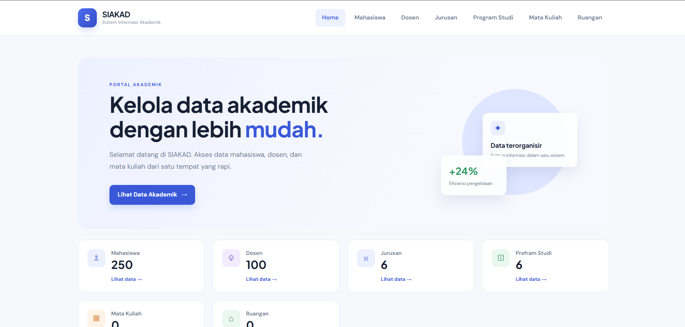

# SIAKAD - Sistem Informasi Akademik

<p align="center">
  
</p>

## Identitas

| Nama     | Ihsan Fadhilah     |
| NIM      | C030325125         |
| Kelas    | TI-3E Axioo        |

## Daftar Route

Berikut adalah daftar route yang dibuat pada project berdasarkan hasil `php artisan route:list`.

### Route Akademik

| Method    | URI                            | Name                     |
| --------- | ------------------------------ | ------------------------ |
| GET       | `/akademik/mapel`              | `akademik.mapel.index`   |
| POST      | `/akademik/mapel`              | `akademik.mapel.store`   |
| GET       | `/akademik/mapel/create`       | `akademik.mapel.create`  |
| GET       | `/akademik/mapel/{mapel}`      | `akademik.mapel.show`    |
| PUT/PATCH | `/akademik/mapel/{mapel}`      | `akademik.mapel.update`  |
| DELETE    | `/akademik/mapel/{mapel}`      | `akademik.mapel.destroy` |
| GET       | `/akademik/mapel/{mapel}/edit` | `akademik.mapel.edit`    |
| GET       | `/akademik/siswa`              | `akademik.siswa.index`   |
| POST      | `/akademik/siswa`              | `akademik.siswa.store`   |
| GET       | `/akademik/siswa/create`       | `akademik.siswa.create`  |
| GET       | `/akademik/siswa/{siswa}`      | `akademik.siswa.show`    |
| PUT/PATCH | `/akademik/siswa/{siswa}`      | `akademik.siswa.update`  |
| DELETE    | `/akademik/siswa/{siswa}`      | `akademik.siswa.destroy` |
| GET       | `/akademik/siswa/{siswa}/edit` | `akademik.siswa.edit`    |

### Route Data Akademik Lainnya

| Method    | URI                             | Name                     |
| --------- | ------------------------------- | ------------------------ |
| GET       | `/dosen`                        | `dosen.index`            |
| POST      | `/dosen`                        | `dosen.store`            |
| GET       | `/dosen/create`                 | `dosen.create`           |
| GET       | `/jurusan`                      | `jurusan.index`          |
| POST      | `/jurusan`                      | `jurusan.store`          |
| GET       | `/jurusan/create`               | `jurusan.create`         |
| GET       | `/mahasiswa`                    | `mahasiswa.index`        |
| POST      | `/mahasiswa`                    | `mahasiswa.store`        |
| GET       | `/mahasiswa/create`             | `mahasiswa.create`       |
| GET       | `/mahasiswa/{mahasiswa}`        | `/mahasiswa/{mahasiswa}` |
| GET       | `/matakuliah`                   | `matakuliah.index`       |
| POST      | `/matakuliah`                   | `matakuliah.store`       |
| GET       | `/matakuliah/create`            | `matakuliah.create`      |
| GET       | `/matakuliah/{matakuliah}`      | `matakuliah.show`        |
| PUT/PATCH | `/matakuliah/{matakuliah}`      | `matakuliah.update`      |
| DELETE    | `/matakuliah/{matakuliah}`      | `matakuliah.destroy`     |
| GET       | `/matakuliah/{matakuliah}/edit` | `matakuliah.edit`        |
| GET       | `/prodi`                        | `prodi.index`            |
| POST      | `/prodi`                        | `prodi.store`            |
| GET       | `/prodi/create`                 | `prodi.create`           |
| GET       | `/ruang`                        | `ruang.index`            |
| POST      | `/ruang`                        | `ruang.store`            |
| GET       | `/ruang/create`                 | `ruang.create`           |

### Route Halaman

| Method | URI                |
| ------ | ------------------ |
| GET    | `/`                |
| GET    | `/home`            |
| GET    | `/halo`            |
| GET    | `/kontak`          |
| GET    | `/tentang`         |
| GET    | `/profil`          |
| GET    | `/sapa`            |
| GET    | `/statistik`       |
| GET    | `/xss`             |
| GET    | `/admin/dashboard` |

## Menjalankan Project

### 1. Install dependency

```bash
composer install
```

### 2. Konfigurasi file `.env`

Salin `.env.example` menjadi `.env`, kemudian sesuaikan konfigurasi database.

```bash
copy .env.example .env
```

Contoh konfigurasi:

```env
DB_CONNECTION=mysql
DB_HOST=127.0.0.1
DB_PORT=3306
DB_DATABASE=nama_database
DB_USERNAME=root
DB_PASSWORD=
```

### 3. Generate application key

```bash
php artisan key:generate
```

### 4. Jalankan migration

```bash
php artisan migrate
```

### 5. Jalankan server

```bash
php artisan serve
```

### 6. Buka aplikasi

```text
http://127.0.0.1:8000
```

## Perintah Melihat Route

Untuk melihat daftar route pada project:

```bash
php artisan route:list
```
